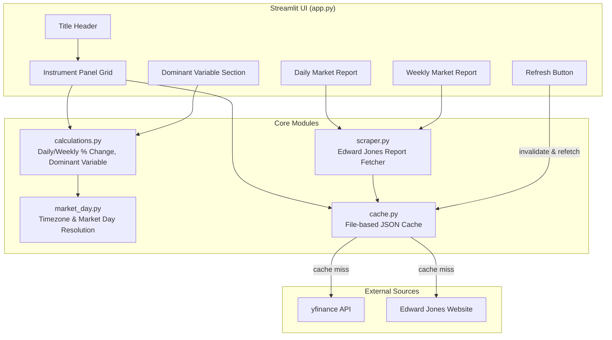

# Design Document: Dashboard Simplification

## Overview

This design replaces the existing multi-page Streamlit dashboard with a single-page application that provides a focused macro analysis view. The simplified dashboard tracks 7 key instruments (US10Y, US2Y, DXY, Oil, SPY, QQQ, VIX), displays daily/weekly percentage changes with color coding, identifies the dominant market variable, and displays scraped Edward Jones market reports — all on a single vertically-scrollable page.

The architectural approach favors simplicity: a thin Streamlit UI layer backed by pure-function modules for calculations, a dedicated scraper module, and a file-based JSON cache. The existing `lib/data_fetcher.py` and yfinance/FRED integrations are reused where applicable, but the multi-page structure (`pages/` directory) and Supabase dependency are removed in favor of local caching.

### Key Design Decisions

1. **Single-file app** — `app.py` is rewritten as the sole entry point; the `pages/` directory is retired.
2. **File-based JSON cache** — replaces Supabase and `@st.cache_data` for persistent cross-session caching, keyed by calendar date in User_Timezone (UTC+4).
3. **Simplified instrument list** — 7 fixed instruments with yfinance as the sole data source (FRED is not needed since US10Y and US2Y can be fetched via `^TNX` and `^IRX`/`^TYX` tickers on yfinance).
4. **Pure calculation module** — all percentage change and dominant variable logic is testable without Streamlit or network dependencies.
5. **BeautifulSoup scraper** — dedicated module for Edward Jones page parsing with its own TTL-based cache.

## Architecture



### Module Responsibilities

| Module | Responsibility |
|--------|---------------|
| `app.py` | Streamlit page layout, rendering, refresh button logic |
| `lib/market_day.py` | Resolve latest US market day from Mauritius TZ (UTC+4) |
| `lib/calculations.py` | Compute daily/weekly % changes, identify dominant variable |
| `lib/scraper.py` | Fetch & parse Edward Jones daily/weekly reports |
| `lib/cache.py` | Read/write JSON cache files, TTL validation, invalidation |
| `lib/data_fetcher.py` | Simplified: fetch OHLCV from yfinance for 7 instruments |

## Components and Interfaces

### 1. Market Day Resolution (`lib/market_day.py`)

```python
from datetime import date, datetime

def get_latest_market_day() -> date:
    """Determine the most recent completed US market day.
    
    Converts current UTC+4 time to US Eastern, checks if market
    has closed (16:00 ET), accounts for weekends and US holidays.
    
    Returns:
        The date of the latest completed trading day.
    """
    ...

def get_current_trading_week(reference_date: date) -> tuple[date, date]:
    """Get the Monday-Friday bounds of the most recently completed trading week.
    
    Adjusts for holidays: uses first trading day as 'Monday open' 
    and last trading day as 'Friday close'.
    
    Returns:
        (week_start, week_end) - dates for open/close price lookup.
    """
    ...

def is_us_market_holiday(d: date) -> bool:
    """Check if a date is a US stock market holiday."""
    ...
```

### 2. Calculations (`lib/calculations.py` — simplified)

```python
from dataclasses import dataclass

@dataclass
class InstrumentData:
    ticker: str
    macro_significance: str
    daily_change_pct: float | None  # None if data unavailable
    weekly_change_pct: float | None

@dataclass
class DominantVariable:
    ticker: str
    macro_significance: str
    daily_change_pct: float
    commentary: str

def compute_daily_change(open_price: float, close_price: float) -> float:
    """((close - open) / open) * 100, rounded to 2 decimal places."""
    ...

def compute_weekly_change(monday_open: float, friday_close: float) -> float:
    """((friday_close - monday_open) / monday_open) * 100, rounded to 2 decimal places."""
    ...

def identify_dominant_variable(instruments: list[InstrumentData]) -> DominantVariable:
    """Select instrument with largest |daily_change_pct|.
    
    Tiebreaker: first in instrument order (US10Y, US2Y, DXY, Oil, SPY, QQQ, VIX).
    """
    ...
```

### 3. Scraper (`lib/scraper.py`)

```python
from dataclasses import dataclass
from datetime import datetime

@dataclass
class MarketReport:
    title: str
    publication_date: str
    body: str  # Truncated to 5000 chars
    fetched_at: datetime

def fetch_daily_recap() -> MarketReport:
    """Scrape Edward Jones daily market recap.
    
    URL: https://www.edwardjones.ca/ca-en/market-news-insights/stock-market-news/daily-market-recap
    Timeout: 15 seconds.
    """
    ...

def fetch_weekly_update() -> MarketReport:
    """Scrape Edward Jones weekly market update.
    
    URL: https://www.edwardjones.com/us-en/market-news-insights/stock-market-news/stock-market-weekly-update
    Timeout: 15 seconds.
    """
    ...
```

### 4. Cache (`lib/cache.py`)

```python
from datetime import datetime
from pathlib import Path
from typing import Any

CACHE_DIR = Path(".cache")

def read_cache(key: str, max_age_hours: float | None = None) -> Any | None:
    """Read cached data if fresh. Returns None if stale or missing.
    
    Args:
        key: Cache key (e.g., "instruments_2024-01-15", "daily_report")
        max_age_hours: Maximum age in hours before data is stale.
                       None means valid for current calendar day (UTC+4).
    """
    ...

def write_cache(key: str, data: Any) -> bool:
    """Write data to cache. Returns False on failure (logs warning, doesn't raise)."""
    ...

def invalidate_cache(key: str) -> None:
    """Remove a specific cache entry."""
    ...

def invalidate_stale_instrument_data() -> None:
    """Remove instrument cache entries from previous calendar days (UTC+4)."""
    ...
```

### 5. Data Fetcher (simplified `lib/data_fetcher.py`)

```python
import pandas as pd
from datetime import date

INSTRUMENTS = {
    "US10Y": {"ticker": "^TNX", "significance": "Growth/Rates"},
    "US2Y": {"ticker": "^IRX", "significance": "Fed Expectations"},
    "DXY": {"ticker": "DX-Y.NYB", "significance": "Global Liquidity"},
    "Oil": {"ticker": "CL=F", "significance": "Fear/Real yields"},
    "SPY": {"ticker": "SPY", "significance": "Risk Appetite"},
    "QQQ": {"ticker": "QQQ", "significance": "Growth/Liquidity"},
    "VIX": {"ticker": "^VIX", "significance": "Fear"},
}

def fetch_instrument_prices(market_day: date, week_start: date, week_end: date) -> dict:
    """Fetch OHLCV data for all 7 instruments.
    
    Makes at most 7 API calls (one per instrument).
    Returns dict mapping instrument key to price data (open, close, weekly_open, weekly_close).
    """
    ...
```

### 6. Streamlit App (`app.py`)

The app orchestrates the flow:
1. Call `get_latest_market_day()` to resolve the reference date.
2. Check cache for instrument data for that date.
3. On cache miss (or manual refresh), call `fetch_instrument_prices()`.
4. Compute daily/weekly changes via pure functions.
5. Identify dominant variable.
6. Check cache for scraped reports (with TTL: 4h daily, 12h weekly).
7. Render all sections in a single page layout.

## Data Models

### Instrument Configuration

```python
INSTRUMENT_ORDER = ["US10Y", "US2Y", "DXY", "Oil", "SPY", "QQQ", "VIX"]

INSTRUMENT_CONFIG = {
    "US10Y": {"ticker": "^TNX", "macro_significance": "Growth/Rates"},
    "US2Y":  {"ticker": "^IRX", "macro_significance": "Fed Expectations"},
    "DXY":   {"ticker": "DX-Y.NYB", "macro_significance": "Global Liquidity"},
    "Oil":   {"ticker": "CL=F", "macro_significance": "Fear/Real yields"},
    "SPY":   {"ticker": "SPY", "macro_significance": "Risk Appetite"},
    "QQQ":   {"ticker": "QQQ", "macro_significance": "Growth/Liquidity"},
    "VIX":   {"ticker": "^VIX", "macro_significance": "Fear"},
}
```

### Cache File Structure

Cache files are stored under `.cache/` as JSON:

```
.cache/
├── instruments_2024-01-15.json    # Keyed by date (UTC+4)
├── daily_report.json               # TTL-based (4 hours)
└── weekly_report.json              # TTL-based (12 hours)
```

**Instrument cache schema:**
```json
{
  "date": "2024-01-15",
  "fetched_at": "2024-01-15T10:30:00+04:00",
  "instruments": {
    "US10Y": {
      "open": 4.52,
      "close": 4.55,
      "weekly_open": 4.48,
      "weekly_close": 4.55,
      "daily_change_pct": 0.66,
      "weekly_change_pct": 1.56
    }
  }
}
```

**Report cache schema:**
```json
{
  "fetched_at": "2024-01-15T10:30:00+04:00",
  "title": "Markets rally on...",
  "publication_date": "January 15, 2024",
  "body": "..."
}
```

### Dataclasses

```python
from dataclasses import dataclass
from datetime import date, datetime

@dataclass
class InstrumentData:
    """Processed instrument data ready for display."""
    ticker: str
    macro_significance: str
    daily_change_pct: float | None
    weekly_change_pct: float | None
    data_available: bool = True

@dataclass
class DominantVariable:
    """The identified dominant market variable."""
    ticker: str
    macro_significance: str
    daily_change_pct: float
    commentary: str

@dataclass
class MarketReport:
    """A scraped market report."""
    title: str
    publication_date: str
    body: str  # Max 5000 chars
    fetched_at: datetime
    available: bool = True
    error_message: str | None = None

@dataclass
class CacheEntry:
    """Metadata wrapper for cached data."""
    key: str
    data: dict
    fetched_at: datetime
    expires_at: datetime | None  # None = valid for current day only
```

## Correctness Properties

*A property is a characteristic or behavior that should hold true across all valid executions of a system — essentially, a formal statement about what the system should do. Properties serve as the bridge between human-readable specifications and machine-verifiable correctness guarantees.*

### Property 1: Daily change formula correctness

*For any* valid open price (nonzero positive float) and close price (positive float), `compute_daily_change(open, close)` SHALL return `round(((close - open) / open) * 100, 2)` — the result must always have at most 2 decimal places and match the specified formula exactly.

**Validates: Requirements 2.3, 4.4**

### Property 2: Weekly change formula correctness

*For any* valid Monday open price (nonzero positive float) and Friday close price (positive float), `compute_weekly_change(monday_open, friday_close)` SHALL return `round(((friday_close - monday_open) / monday_open) * 100, 2)` — the result must always have at most 2 decimal places and match the specified formula exactly.

**Validates: Requirements 2.4, 4.5**

### Property 3: Color coding is determined by sign

*For any* percentage change value (float), the color selection function SHALL return "green" when the value is positive, "red" when the value is negative, and "default" (no color) when the value is exactly zero. This must hold regardless of whether the value represents a daily or weekly change.

**Validates: Requirements 3.1, 3.2, 3.3, 3.4**

### Property 4: Market day resolution returns a valid completed trading day

*For any* datetime (representing "now" in UTC+4), `get_latest_market_day()` SHALL return a date that is: (a) a weekday, (b) not a US market holiday, (c) on or before today in US Eastern Time, and (d) the market close (16:00 ET) has already passed relative to the input time.

**Validates: Requirements 4.1**

### Property 5: Dominant variable is the instrument with maximum absolute daily change

*For any* list of InstrumentData where at least one instrument has a non-None daily_change_pct, `identify_dominant_variable` SHALL return the instrument with the largest `abs(daily_change_pct)`. When two or more instruments tie for the largest absolute value, the instrument appearing earliest in the defined order (US10Y, US2Y, DXY, Oil, SPY, QQQ, VIX) SHALL be selected.

**Validates: Requirements 5.2, 5.4**

### Property 6: Report body truncation preserves content up to 5000 characters

*For any* string body text, the truncation function SHALL produce a result with `len(result) <= 5000`. If `len(body) <= 5000`, the result SHALL equal the original body. If `len(body) > 5000`, the result SHALL equal `body[:5000]`.

**Validates: Requirements 6.3, 6.4**

### Property 7: Cache TTL freshness check

*For any* `fetched_at` timestamp and `current_time` timestamp, and a given `max_age_hours` TTL value, the cache freshness function SHALL return `True` (fresh) if and only if `(current_time - fetched_at) < timedelta(hours=max_age_hours)`. It SHALL return `False` (stale) otherwise.

**Validates: Requirements 6.6**

### Property 8: Cache date-based validity for instrument data

*For any* two timestamps `t_write` and `t_read` in UTC+4, if `t_write.date() == t_read.date()` (same calendar day), then instrument data cached at `t_write` SHALL be considered valid at `t_read`. If `t_write.date() != t_read.date()` (different calendar days), the cached data SHALL be considered stale.

**Validates: Requirements 7.2, 7.5**

### Property 9: Refresh cooldown enforcement

*For any* `last_refresh_time` and `current_time` timestamps, the refresh cooldown function SHALL return `True` (refresh allowed) if and only if `(current_time - last_refresh_time) >= timedelta(seconds=60)`. It SHALL return `False` (refresh blocked) otherwise.

**Validates: Requirements 8.4**

## Error Handling

### Data Fetch Failures

| Scenario | Behavior |
|----------|----------|
| yfinance returns no data for an instrument | Set `data_available=False` on that instrument; display "Data unavailable" |
| yfinance raises an exception for one instrument | Log warning, continue with remaining instruments |
| All 7 instruments fail | Display page with all panels showing "Data unavailable"; do not crash |
| Network timeout on yfinance | Use cached data if available; else show unavailable |

### Scraper Failures

| Scenario | Behavior |
|----------|----------|
| HTTP request to Edward Jones times out (>15s) | Show fallback message with last successful fetch date |
| Page structure changed (parsing fails) | Same fallback behavior as timeout |
| Network is unreachable | Same fallback; rely on cached report if available |

### Cache Failures

| Scenario | Behavior |
|----------|----------|
| Cache directory not writable | Log warning; operate without caching (fresh fetch each load) |
| Cache file corrupted (invalid JSON) | Delete corrupted file; treat as cache miss |
| Disk full | Log warning; skip write; continue with in-memory data |

### Refresh Button Edge Cases

| Scenario | Behavior |
|----------|----------|
| User clicks refresh during cooldown (<60s) | Button is disabled; no action taken |
| Refresh partially succeeds (3/7 instruments) | Update successful instruments; keep cached data for failed ones; show warning |

## Testing Strategy

### Property-Based Tests (Hypothesis)

The project already has Hypothesis configured in `pyproject.toml` with 100 iterations (default profile). Each correctness property maps to one property-based test:

| Test | Property | Module Under Test |
|------|----------|-------------------|
| `test_daily_change_formula` | Property 1 | `lib/calculations.py` |
| `test_weekly_change_formula` | Property 2 | `lib/calculations.py` |
| `test_color_coding_by_sign` | Property 3 | `lib/calculations.py` |
| `test_market_day_valid_trading_day` | Property 4 | `lib/market_day.py` |
| `test_dominant_variable_max_absolute` | Property 5 | `lib/calculations.py` |
| `test_report_body_truncation` | Property 6 | `lib/scraper.py` |
| `test_cache_ttl_freshness` | Property 7 | `lib/cache.py` |
| `test_cache_date_validity` | Property 8 | `lib/cache.py` |
| `test_refresh_cooldown` | Property 9 | `app.py` (cooldown logic) |

**Configuration:**
- Library: `hypothesis` (already installed, v6.131.15)
- Min iterations: 100 (configured in `pyproject.toml` under `[tool.hypothesis.profiles.default]`)
- Each test tagged with: `# Feature: dashboard-simplification, Property N: <property text>`
- Test location: `tests/properties/test_dashboard_simplification.py`

### Unit Tests (pytest)

Focused on specific examples and edge cases not covered by properties:

| Test | Validates |
|------|-----------|
| `test_instrument_config_has_7_entries` | Req 2.1, 2.2 |
| `test_significance_labels_correct` | Req 2.2 |
| `test_unavailable_data_shows_placeholder` | Req 2.5 |
| `test_zero_change_default_color` | Req 3.5 |
| `test_none_change_no_color` | Req 3.6 |
| `test_weekend_falls_back_to_friday` | Req 4.2 |
| `test_before_market_close_uses_previous_day` | Req 4.3 |
| `test_monday_holiday_uses_tuesday_open` | Req 4.6 |
| `test_friday_holiday_uses_thursday_close` | Req 4.7 |
| `test_scraper_timeout_shows_fallback` | Req 6.5 |
| `test_cache_write_failure_continues` | Req 7.6 |
| `test_partial_fetch_failure_uses_cached` | Req 8.5 |

**Test location:** `tests/unit/test_dashboard_simplification.py`

### Integration Tests

| Test | Validates |
|------|-----------|
| `test_scraper_parses_daily_report` | Req 6.1 (mocked HTTP) |
| `test_scraper_parses_weekly_report` | Req 6.2 (mocked HTTP) |
| `test_full_page_renders_all_sections` | Req 1.1, 1.2, 1.3 |
| `test_refresh_button_triggers_fetch` | Req 8.3 |

**Test location:** `tests/integration/test_dashboard_simplification.py`

