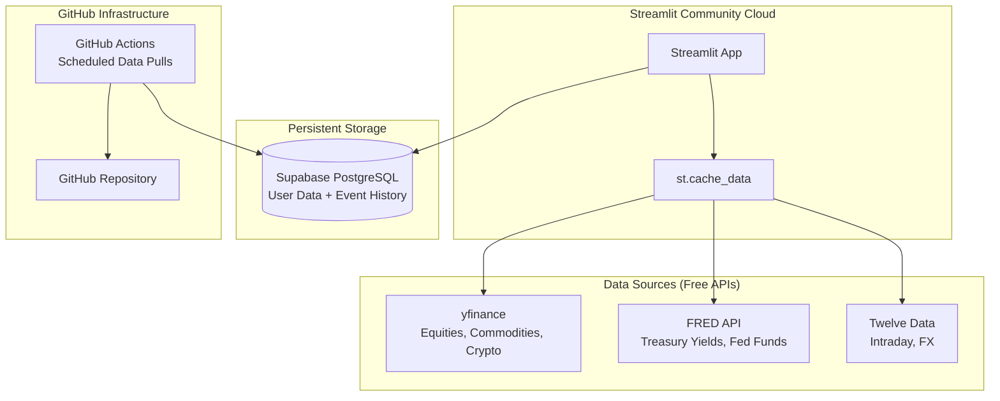
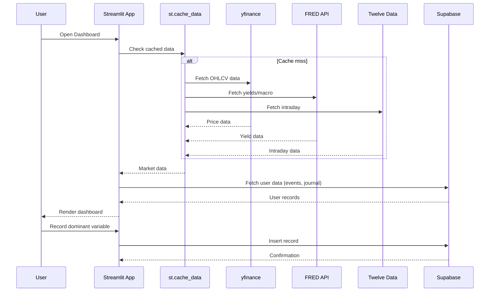

# Design Document: Global Macro Intelligence Dashboard

## Overview

The Global Macro Intelligence Dashboard is a Python-based Streamlit application that provides real-time macro asset monitoring, cross-asset relationship analysis, dominant variable identification, historical event analysis, and expectation-vs-reality tracking. It is designed as a learning tool to develop institutional-grade macro thinking.

### Tech Stack

| Layer | Technology | Rationale |
|-------|-----------|-----------|
| UI Framework | Streamlit | Free hosting on Community Cloud, rapid prototyping, Python-native |
| Charting | streamlit-lightweight-charts | TradingView-quality financial charts with native scroll-zoom and drag-pan |
| Correlation/Overlay Charts | Plotly (st.plotly_chart) | Flexible for heatmaps, correlation matrices, and multi-asset overlays |
| Market Data (Equities/Crypto/Commodities) | yfinance | Free, no API key needed, good for OHLCV data |
| Market Data (Macro/Yields) | FRED API (fredapi) | Free API key, authoritative source for Treasury yields, Fed funds rate |
| Market Data (Intraday/Supplemental) | Twelve Data | Free tier (800 req/day), fills gaps for intraday and FX data |
| Persistent Storage | Supabase (PostgreSQL) | Free tier 500MB, official Streamlit integration, handles user-generated data |
| Caching | Streamlit st.cache_data | Reduces API calls, respects rate limits |
| Data Processing | pandas, numpy, scipy | Standard Python data science stack |
| Scheduling/Updates | GitHub Actions | Periodic data pulls to keep cached data fresh |
| Hosting | Streamlit Community Cloud | Free, GitHub-connected, auto-deploys on push |

### Key Design Decisions

1. **Dual charting approach**: streamlit-lightweight-charts for primary asset charts (candlestick/line with TradingView UX), Plotly for correlation matrices and multi-asset overlays where heatmap/scatter capabilities are needed.

2. **Multi-source data strategy**: Combine yfinance (equities, commodities, crypto, FX), FRED (yields, macro indicators), and Twelve Data (intraday fills) to maximize free-tier coverage and data quality.

3. **Supabase for persistence**: User-generated data (journal entries, custom events, dominant variable selections, expectations) persists in Supabase PostgreSQL. Market data is fetched fresh and cached in-session.

4. **GitHub Actions for pre-caching**: Scheduled workflows pull and store historical data snapshots, reducing cold-start load times and API pressure during user sessions.

## Architecture

### System Architecture Diagram



### Data Flow



### Page Structure

The app uses Streamlit's multi-page architecture:

```
app.py (main entry, navigation)
├── pages/
│   ├── 1_📊_Asset_Monitor.py
│   ├── 2_🔗_Cross_Asset.py
│   ├── 3_🎯_Dominant_Variable.py
│   ├── 4_📅_Event_Analysis.py
│   └── 5_📈_Expectations.py
├── lib/
│   ├── data_fetcher.py      (API integration layer)
│   ├── calculations.py      (correlations, dominant var logic)
│   ├── db.py                (Supabase client)
│   └── models.py            (data models/schemas)
└── .streamlit/
    └── secrets.toml         (API keys, Supabase credentials)
```

## Components and Interfaces

### 1. Data Fetcher Module (`lib/data_fetcher.py`)

Responsible for fetching market data from multiple sources with caching and rate-limit awareness.

```python
class DataFetcher:
    """Unified interface for fetching market data from multiple sources."""

    def get_asset_data(
        self,
        symbol: str,
        interval: str,
        start_date: datetime,
        end_date: datetime
    ) -> pd.DataFrame:
        """Fetch OHLCV data for a given asset.
        
        Returns DataFrame with columns: open, high, low, close, volume, timestamp
        Routes to appropriate source based on symbol type.
        """

    def get_yield_data(
        self,
        series_id: str,
        start_date: datetime,
        end_date: datetime
    ) -> pd.DataFrame:
        """Fetch yield/macro data from FRED.
        
        Returns DataFrame with columns: date, value
        """

    def get_current_prices(self, symbols: list[str]) -> dict[str, AssetPrice]:
        """Fetch latest prices for all tracked assets.
        
        Returns dict mapping symbol to AssetPrice with current, change, pct_change.
        """

    def get_economic_calendar(
        self,
        start_date: datetime,
        end_date: datetime
    ) -> list[EconomicEvent]:
        """Fetch upcoming/past economic releases."""
```

### 2. Calculations Module (`lib/calculations.py`)

Pure functions for computing correlations, dominant variables, and surprise magnitudes.

```python
def compute_correlation_matrix(
    price_data: dict[str, pd.Series],
    window: int
) -> pd.DataFrame:
    """Compute rolling correlation matrix between assets.
    
    Args:
        price_data: Dict mapping asset name to price series (returns-based)
        window: Rolling window in trading days
    
    Returns:
        DataFrame with correlation values between all asset pairs
    """

def identify_dominant_variable(
    asset_returns: dict[str, float],
    correlations: pd.DataFrame
) -> list[DominantFactor]:
    """Identify top contributing factors for current session.
    
    Uses magnitude of moves weighted by cross-asset correlation strength
    to rank which variable is driving markets.
    
    Returns list of DominantFactor sorted by influence score (top 3).
    """

def compute_correlation_changes(
    current_corr: pd.DataFrame,
    prior_corr: pd.DataFrame,
    threshold: float = 0.3
) -> list[CorrelationShift]:
    """Detect significant correlation shifts.
    
    Returns list of asset pairs where correlation changed by > threshold.
    """

def compute_surprise_magnitude(
    actual: float,
    expected: float,
    historical_std: float
) -> float:
    """Calculate normalized surprise magnitude.
    
    Returns (actual - expected) / historical_std
    """

def normalize_prices(
    price_series: dict[str, pd.Series],
    base_date: datetime
) -> dict[str, pd.Series]:
    """Normalize multiple price series to 100 at base_date for overlay comparison."""
```

### 3. Database Module (`lib/db.py`)

Handles all Supabase interactions for persistent user data.

```python
class MacroDB:
    """Supabase database interface for user-generated data."""

    def __init__(self, url: str, key: str): ...

    # Dominant Variable
    def save_dominant_variable(self, date: date, variable: str, notes: str) -> None: ...
    def get_dominant_variable_history(self, days: int) -> list[DominantVariableRecord]: ...

    # Macro Events
    def save_macro_event(self, event: MacroEvent) -> None: ...
    def get_macro_events(self, category: str | None, start: date, end: date) -> list[MacroEvent]: ...

    # Expectations
    def save_expectation(self, expectation: ExpectationRecord) -> None: ...
    def get_expectations_history(self, indicator: str | None) -> list[ExpectationRecord]: ...

    # Custom Assets
    def save_custom_asset(self, symbol: str, name: str) -> None: ...
    def get_custom_assets(self) -> list[CustomAsset]: ...
```

### 4. Page Components

Each page is a self-contained Streamlit script that composes the above modules:

| Page | Primary Components | Key Interactions |
|------|-------------------|------------------|
| Asset Monitor | Lightweight Charts (candlestick/line), price panels | DataFetcher → Chart rendering, interval selector |
| Cross Asset | Plotly heatmap, Lightweight Charts overlay | DataFetcher → Calculations → Plotly/LWC rendering |
| Dominant Variable | Ranking display, timeline chart, input form | Calculations → Display, User input → DB |
| Event Analysis | Event list, multi-asset reaction charts | DB → DataFetcher → Chart rendering |
| Expectations | Release table, surprise chart, reaction panels | DataFetcher → Calculations → DB → Display |

## Data Models

### Asset Configuration

```python
from dataclasses import dataclass
from datetime import datetime, date
from enum import Enum

class AssetSource(Enum):
    YFINANCE = "yfinance"
    FRED = "fred"
    TWELVE_DATA = "twelve_data"

class ChartType(Enum):
    CANDLESTICK = "candlestick"
    LINE = "line"

@dataclass
class TrackedAsset:
    """Configuration for a tracked asset."""
    symbol: str           # e.g., "^TNX", "DX-Y.NYB", "GC=F"
    display_name: str     # e.g., "US 10Y Yield", "DXY", "Gold"
    source: AssetSource
    fred_series_id: str | None = None  # For FRED-sourced data
    category: str = "default"          # For grouping in UI

@dataclass
class AssetPrice:
    """Current price snapshot for an asset."""
    symbol: str
    price: float
    change: float
    pct_change: float
    timestamp: datetime
```

### Default Tracked Assets

```python
DEFAULT_ASSETS = [
    TrackedAsset("DGS10", "US 10Y Yield", AssetSource.FRED, fred_series_id="DGS10"),
    TrackedAsset("DGS2", "US 2Y Yield", AssetSource.FRED, fred_series_id="DGS2"),
    TrackedAsset("DX-Y.NYB", "DXY", AssetSource.YFINANCE),
    TrackedAsset("CL=F", "Oil (WTI)", AssetSource.YFINANCE),
    TrackedAsset("GC=F", "Gold", AssetSource.YFINANCE),
    TrackedAsset("^GSPC", "S&P 500", AssetSource.YFINANCE),
    TrackedAsset("^VIX", "VIX", AssetSource.YFINANCE),
    TrackedAsset("BTC-USD", "Bitcoin", AssetSource.YFINANCE),
]
```

### User-Generated Data Models (Supabase Tables)

```python
class EventCategory(Enum):
    MONETARY_POLICY = "monetary_policy"
    INFLATION_DATA = "inflation_data"
    GEOPOLITICAL = "geopolitical"
    FISCAL_POLICY = "fiscal_policy"

@dataclass
class MacroEvent:
    """A recorded macro event."""
    id: str | None
    date: date
    description: str
    category: EventCategory
    is_custom: bool = False  # User-added vs system-provided

@dataclass
class DominantVariableRecord:
    """Daily dominant variable selection."""
    id: str | None
    date: date
    variable: str          # e.g., "rates", "USD", "oil", "liquidity"
    influence_score: float | None  # System-calculated score
    notes: str = ""        # User's reasoning
    is_manual: bool = False  # User override vs system suggestion

@dataclass
class ExpectationRecord:
    """Tracks expected vs actual for economic releases."""
    id: str | None
    release_date: date
    indicator: str         # e.g., "CPI", "NFP", "Fed Funds"
    expected_value: float
    actual_value: float | None
    surprise_magnitude: float | None  # Normalized surprise
    asset_reactions: dict | None      # {symbol: {5min: %, 1hr: %, 1day: %}}

@dataclass
class CustomAsset:
    """User-added custom ticker."""
    symbol: str
    display_name: str
    source: AssetSource
    added_date: date
```

### Supabase Schema (SQL)

```sql
-- Macro events table
CREATE TABLE macro_events (
    id UUID DEFAULT gen_random_uuid() PRIMARY KEY,
    event_date DATE NOT NULL,
    description TEXT NOT NULL,
    category TEXT NOT NULL CHECK (category IN ('monetary_policy', 'inflation_data', 'geopolitical', 'fiscal_policy')),
    is_custom BOOLEAN DEFAULT FALSE,
    created_at TIMESTAMPTZ DEFAULT NOW()
);

-- Dominant variable daily records
CREATE TABLE dominant_variables (
    id UUID DEFAULT gen_random_uuid() PRIMARY KEY,
    record_date DATE NOT NULL UNIQUE,
    variable TEXT NOT NULL,
    influence_score REAL,
    notes TEXT DEFAULT '',
    is_manual BOOLEAN DEFAULT FALSE,
    created_at TIMESTAMPTZ DEFAULT NOW()
);

-- Expectation tracking
CREATE TABLE expectations (
    id UUID DEFAULT gen_random_uuid() PRIMARY KEY,
    release_date DATE NOT NULL,
    indicator TEXT NOT NULL,
    expected_value REAL NOT NULL,
    actual_value REAL,
    surprise_magnitude REAL,
    asset_reactions JSONB,
    created_at TIMESTAMPTZ DEFAULT NOW()
);

-- Custom assets added by user
CREATE TABLE custom_assets (
    symbol TEXT PRIMARY KEY,
    display_name TEXT NOT NULL,
    source TEXT NOT NULL,
    added_date DATE DEFAULT CURRENT_DATE
);
```

### Interval Configuration

```python
INTERVALS = {
    "1min": {"yfinance": "1m", "twelve_data": "1min", "label": "1 Minute"},
    "5min": {"yfinance": "5m", "twelve_data": "5min", "label": "5 Minutes"},
    "10min": {"yfinance": None, "twelve_data": "10min", "label": "10 Minutes"},
    "15min": {"yfinance": "15m", "twelve_data": "15min", "label": "15 Minutes"},
    "30min": {"yfinance": "30m", "twelve_data": "30min", "label": "30 Minutes"},
    "1hour": {"yfinance": "1h", "twelve_data": "1h", "label": "1 Hour"},
    "6hour": {"yfinance": None, "twelve_data": None, "label": "6 Hours"},
    "12hour": {"yfinance": None, "twelve_data": None, "label": "12 Hours"},
    "1day": {"yfinance": "1d", "twelve_data": "1day", "label": "1 Day"},
    "1week": {"yfinance": "1wk", "twelve_data": "1week", "label": "1 Week"},
    "1month": {"yfinance": "1mo", "twelve_data": "1month", "label": "1 Month"},
    "2month": {"yfinance": None, "twelve_data": None, "label": "2 Months"},
    "3month": {"yfinance": "3mo", "twelve_data": None, "label": "3 Months"},
    "6month": {"yfinance": None, "twelve_data": None, "label": "6 Months"},
    "1year": {"yfinance": None, "twelve_data": None, "label": "1 Year"},
}
```

*Note: Intervals not natively supported by data sources will be resampled from the finest available granularity.*


## Correctness Properties

*A property is a characteristic or behavior that should hold true across all valid executions of a system — essentially, a formal statement about what the system should do. Properties serve as the bridge between human-readable specifications and machine-verifiable correctness guarantees.*

### Property 1: Price Change Computation

*For any* current price and previous close (both positive floats), the computed absolute change SHALL equal `current - previous` and the percentage change SHALL equal `(current - previous) / previous * 100`.

**Validates: Requirements 1.2**

### Property 2: OHLCV Resampling Invariants

*For any* sequence of OHLCV candles at a fine interval resampled to a coarser interval, the resulting candles SHALL satisfy: open equals the first candle's open in the group, high equals the maximum high across the group, low equals the minimum low across the group, close equals the last candle's close in the group, and volume equals the sum of all volumes in the group.

**Validates: Requirements 1.7**

### Property 3: Correlation Matrix Mathematical Properties

*For any* set of N asset return series (N ≥ 2) with sufficient data points, the computed correlation matrix SHALL be symmetric, have all diagonal values equal to 1.0, and have all off-diagonal values in the range [-1, 1].

**Validates: Requirements 2.1**

### Property 4: Price Normalization Invariant

*For any* set of price series and a valid base date present in all series, normalizing the prices SHALL result in all series having value 100.0 at the base date, and the ratio between any two points in a normalized series SHALL equal the ratio between the corresponding points in the original series.

**Validates: Requirements 2.2**

### Property 5: Correlation Shift Detection Completeness

*For any* pair of correlation matrices (current and prior) and a threshold of 0.3, the detected shifts SHALL include every asset pair where `|current_corr - prior_corr| > threshold` and SHALL exclude every pair where `|current_corr - prior_corr| <= threshold`.

**Validates: Requirements 2.3**

### Property 6: Dominant Variable Ranking Invariant

*For any* non-empty set of asset returns and a valid correlation matrix, the dominant variable identification SHALL return a non-empty list of factors sorted in descending order by influence score, with all scores being non-negative.

**Validates: Requirements 3.1, 3.2**

### Property 7: Domain Object Persistence Round-Trip

*For any* valid MacroEvent or ExpectationRecord, saving the object to the database and then retrieving it SHALL produce an object with all fields equal to the original.

**Validates: Requirements 4.1, 4.4, 5.4**

### Property 8: Surprise Magnitude Computation

*For any* actual value, expected value, and positive historical standard deviation, the surprise magnitude SHALL equal `(actual - expected) / historical_std`. When historical_std is zero or negative, the function SHALL return None or raise a defined error.

**Validates: Requirements 5.2**

### Property 9: Asset Reaction Computation

*For any* price series containing a release timestamp and valid window endpoints (5min, 1hr, 1day after release), the computed reaction SHALL equal `(price_at_window_end - price_at_release) / price_at_release * 100` for each window.

**Validates: Requirements 5.3, 4.2**

## Error Handling

### Data Source Failures

| Scenario | Handling Strategy |
|----------|------------------|
| yfinance API timeout/error | Display stale cached data with "last updated X ago" warning. Retry on next cache cycle. |
| FRED API key invalid/expired | Show error banner with instructions to update secrets. Gracefully degrade — hide yield panels. |
| Twelve Data rate limit exceeded | Fall back to yfinance for available symbols. Show "intraday data unavailable" for others. |
| Supabase connection failure | Show read-only mode banner. Cache user inputs in session state for retry. |
| Invalid ticker symbol (custom asset) | Validate on add — show error if no data returned. Don't persist invalid symbols. |

### Computation Edge Cases

| Scenario | Handling Strategy |
|----------|------------------|
| Insufficient data for correlation (< 5 data points) | Return NaN for that pair, display "insufficient data" in matrix cell. |
| Division by zero in pct_change (previous_close = 0) | Return 0.0 for pct_change, flag as anomalous. |
| Division by zero in surprise (historical_std = 0) | Return None for surprise_magnitude, display "N/A". |
| Missing data points in time series (gaps) | Forward-fill for display, exclude gaps from correlation calculations. |
| Weekend/holiday dates in window calculations | Use trading days only (skip non-trading days). |

### User Input Validation

| Input | Validation |
|-------|-----------|
| Custom ticker symbol | Must be non-empty string, alphanumeric with allowed special chars (^, -, ., =). Verify data exists before saving. |
| Event date | Must be a valid date, not in the future for historical events. |
| Event description | Must be non-empty, max 500 characters. |
| Event category | Must be one of the defined EventCategory enum values. |
| Expected/actual values | Must be numeric. |

## Testing Strategy

### Testing Approach

This project uses a **dual testing approach**:

1. **Property-based tests** (via [Hypothesis](https://hypothesis.readthedocs.io/)): Verify universal correctness properties across randomly generated inputs. Each property test runs a minimum of 100 iterations.
2. **Unit tests** (via pytest): Verify specific examples, edge cases, integration points, and error conditions.

### Property-Based Testing Configuration

- **Library**: Hypothesis (Python)
- **Minimum iterations**: 100 per property (`@settings(max_examples=100)`)
- **Tag format**: `# Feature: global-macro-dashboard, Property {N}: {title}`

### Test Organization

```
tests/
├── properties/
│   ├── test_price_computation.py      # Property 1
│   ├── test_resampling.py             # Property 2
│   ├── test_correlation.py            # Properties 3, 5
│   ├── test_normalization.py          # Property 4
│   ├── test_dominant_variable.py      # Property 6
│   ├── test_persistence.py            # Property 7
│   ├── test_surprise.py              # Property 8
│   └── test_reactions.py             # Property 9
├── unit/
│   ├── test_data_fetcher.py          # API integration, error handling
│   ├── test_calculations.py          # Specific examples, edge cases
│   ├── test_db.py                    # CRUD operations, validation
│   └── test_models.py               # Data model validation
└── conftest.py                       # Shared fixtures, generators
```

### Property Test Mapping

| Property | Test File | What's Generated |
|----------|-----------|-----------------|
| 1: Price Change | test_price_computation.py | Random (current_price, previous_close) floats > 0 |
| 2: OHLCV Resampling | test_resampling.py | Random OHLCV candle sequences with valid timestamps |
| 3: Correlation Matrix | test_correlation.py | Random return series (N assets × M days) |
| 4: Normalization | test_normalization.py | Random price series with shared date range |
| 5: Correlation Shift | test_correlation.py | Random correlation matrix pairs |
| 6: Dominant Variable | test_dominant_variable.py | Random asset returns + correlation matrices |
| 7: Persistence Round-Trip | test_persistence.py | Random MacroEvent and ExpectationRecord objects |
| 8: Surprise Magnitude | test_surprise.py | Random (actual, expected, std) triples |
| 9: Asset Reaction | test_reactions.py | Random price series with release timestamps |

### Unit Test Focus Areas

- **Data Fetcher**: Mock API responses, verify correct source routing, test error/timeout handling
- **Calculations**: Specific known-answer examples (e.g., perfect correlation = 1.0), edge cases (empty data, single data point)
- **Database**: CRUD operations, constraint violations, concurrent access
- **Models**: Enum validation, required field checks, serialization

### Integration Tests

- End-to-end data fetch → compute → display pipeline (with mocked APIs)
- Supabase connection and schema validation
- GitHub Actions workflow dry-run

### Dependencies

```
pytest>=7.0
hypothesis>=6.0
pytest-mock>=3.0
```
